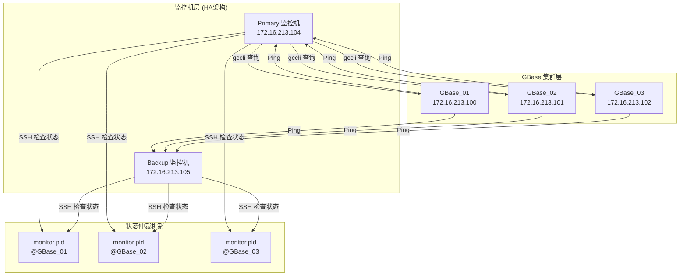
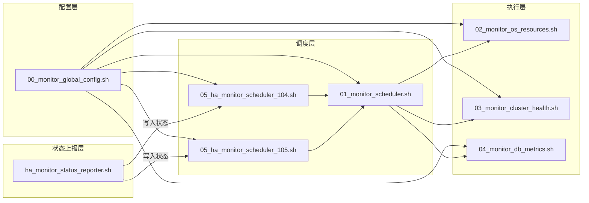
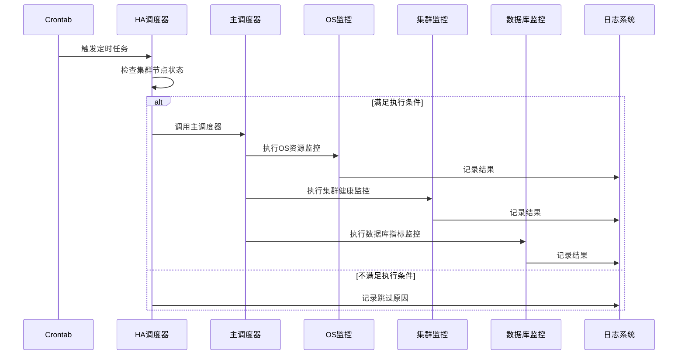
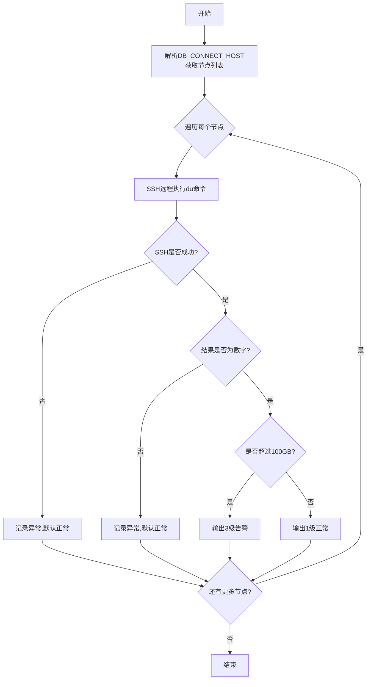
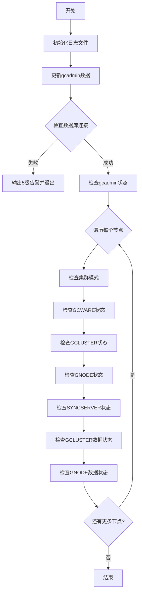
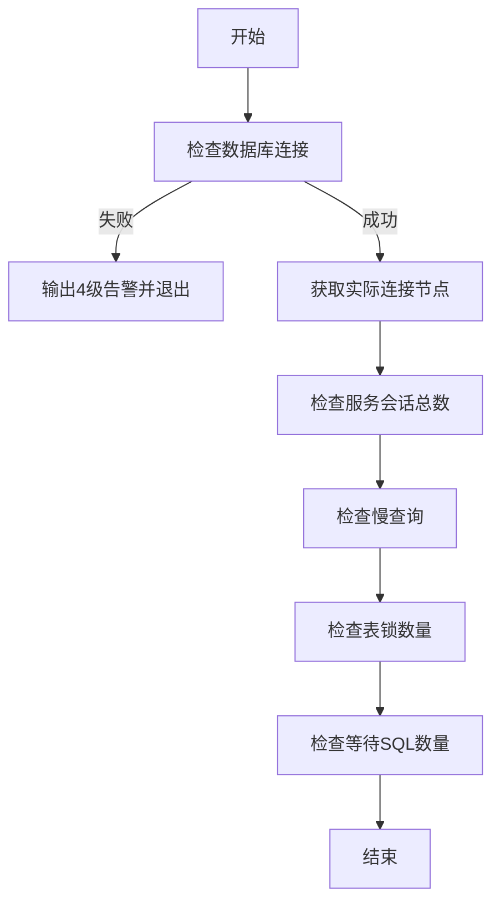
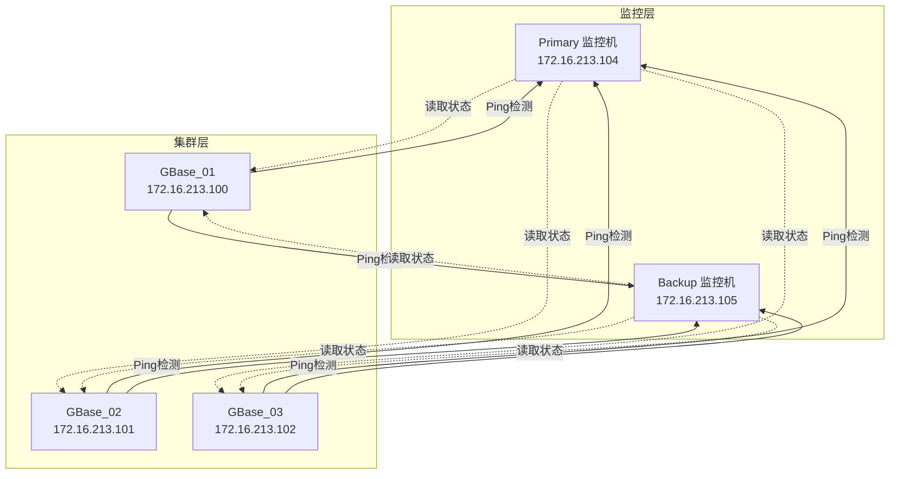
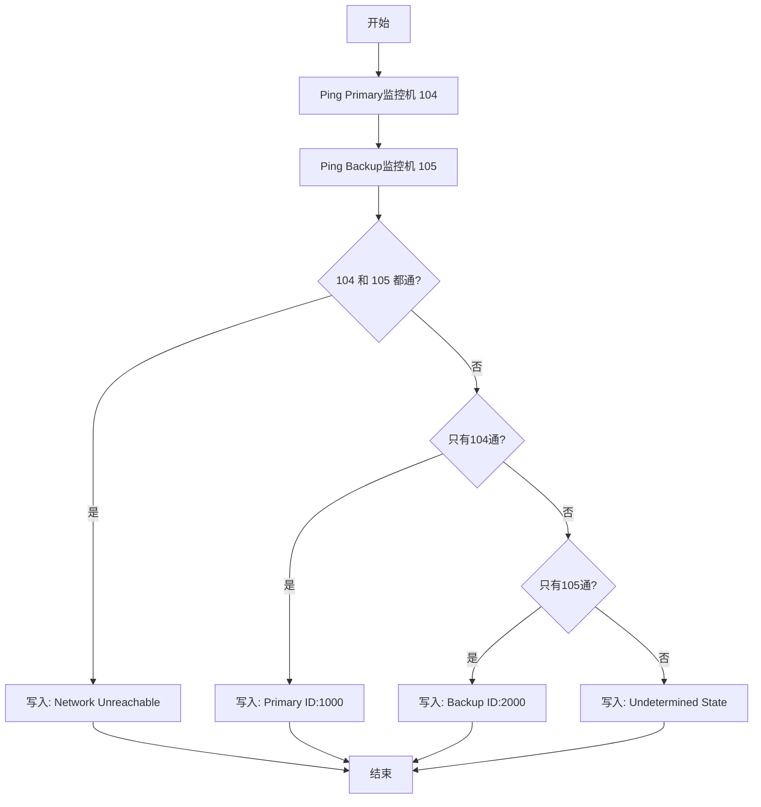
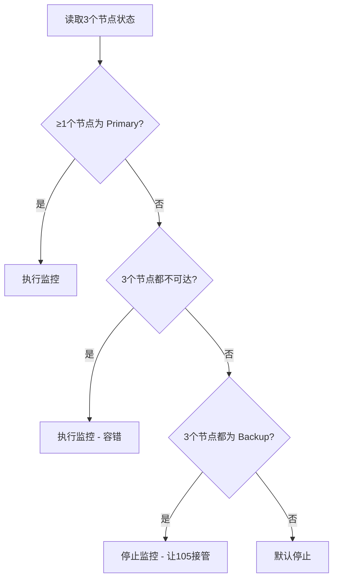
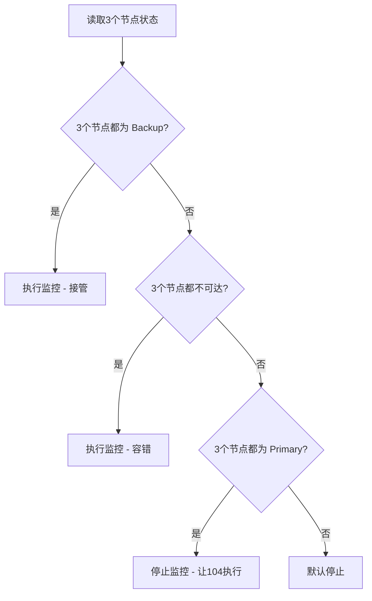

# GBase 数据库集群监控系统技术文档

## 版本信息

| 项目 | 说明 |
|------|------|
| 文档版本 | V1.0 |
| 创建日期 | 2025-01-XX |
| 适用系统 | GBase 8a 集群 |
| 脚本版本 | 3.6 |

---

## 目录

1. [系统概述](#1-系统概述)
2. [架构设计](#2-架构设计)
3. [文件清单与说明](#3-文件清单与说明)
4. [核心配置详解](#4-核心配置详解)
5. [脚本功能详解](#5-脚本功能详解)
6. [高可用 (HA) 架构](#6-高可用-ha-架构)
7. [告警机制](#7-告警机制)
8. [部署指南](#8-部署指南)
9. [日常维护](#9-日常维护)
10. [故障排查](#10-故障排查)
11. [附录](#11-附录)

---

## 1. 系统概述

### 1.1 系统目的

GBase 数据库集群监控系统是一套基于 Shell 脚本的自动化监控解决方案，用于：

- 实时监控 GBase 8a 集群的运行状态
- 自动检测服务异常并生成告警
- 提供高可用的监控架构，确保监控服务本身的可靠性
- 记录详细的运行日志，便于问题追溯和分析

### 1.2 监控范围

本系统覆盖以下监控维度：

| 监控类别 | 监控内容 | 对应脚本 |
|----------|----------|----------|
| 操作系统资源 | 临时表空间使用量 | 02_monitor_os_resources.sh |
| 集群健康状态 | 集群模式、服务进程状态、数据一致性 | 03_monitor_cluster_health.sh |
| 数据库指标 | 会话数、慢查询、表锁、等待SQL | 04_monitor_db_metrics.sh |
| 高可用状态 | 主备监控机切换 | 05_ha_monitor_scheduler_*.sh |

### 1.3 系统架构图



---

## 2. 架构设计

### 2.1 总体架构

系统采用分层设计，包含以下层次：



### 2.2 执行流程



---

## 3. 文件清单与说明

### 3.1 文件结构

```
monitor/
├── 00_monitor_global_config.sh    # 全局配置文件
├── 01_monitor_scheduler.sh        # 主调度脚本
├── 02_monitor_os_resources.sh     # 操作系统资源监控
├── 03_monitor_cluster_health.sh   # 集群健康状态监控
├── 04_monitor_db_metrics.sh       # 数据库业务指标监控
├── 05_ha_monitor_scheduler_104.sh # Primary HA调度器
├── 05_ha_monitor_scheduler_105.sh # Backup HA调度器
├── ha_monitor_status_reporter.sh  # 状态上报脚本
└── log/                           # 日志目录
    ├── gbase_history.log          # 历史日志归档
    ├── gbase_alarm.log            # 告警日志归档
    ├── gbase_latest_status.log    # 当前检查状态
    ├── colour_gbase_latest_status.log  # 带颜色的状态日志
    ├── slow_sql_detail.log        # 慢查询明细日志
    ├── gcadmin.txt                # gcadmin命令输出缓存
    └── gcadmin_last_run.ts        # gcadmin执行时间戳
```

### 3.2 文件功能对照表

| 文件名 | 部署位置 | 功能说明 | 执行频率 |
|--------|----------|----------|----------|
| 00_monitor_global_config.sh | 所有监控机 | 全局配置和公共函数 | 被其他脚本引用 |
| 01_monitor_scheduler.sh | 所有监控机 | 协调执行所有监控任务 | 被HA调度器调用 |
| 02_monitor_os_resources.sh | 所有监控机 | 监控临时表空间大小 | 每5分钟 |
| 03_monitor_cluster_health.sh | 所有监控机 | 监控集群服务状态 | 每5分钟 |
| 04_monitor_db_metrics.sh | 所有监控机 | 监控数据库业务指标 | 每5分钟 |
| 05_ha_monitor_scheduler_104.sh | 172.16.213.104 | Primary监控机调度 | 每5分钟 |
| 05_ha_monitor_scheduler_105.sh | 172.16.213.105 | Backup监控机调度 | 每5分钟 |
| ha_monitor_status_reporter.sh | 100/101/102 | 上报监控机可达性状态 | 每1分钟 |

---

## 4. 核心配置详解

### 4.1 配置文件结构 (00_monitor_global_config.sh)

#### 4.1.1 基础配置

```bash
# 本机IP地址 (部署时必须修改)
MY_IP='81.52.209.118'

# 数据库连接信息
ROOT_USER=gbasechk
ROOT_PASSWD=gbasechk@AQDY2025

# 集群节点IP列表 (逗号分隔)
DB_CONNECT_HOST='172.16.213.100,172.16.213.101,172.16.213.102'

# 内部网络地址
DB_INTERMAL_HOST='172.16.213.100,172.16.213.101,172.16.213.102'

# 主机名映射
HOST_NAMES='GBase_01,GBase_02,GBase_03'
DB_HOSTNAMES='gbase01,gbase02,gbase03'

# SSH配置
SSH_PORT="10022"
```

#### 4.1.2 阈值配置

| 配置项 | 变量名 | 默认值 | 说明 |
|--------|--------|--------|------|
| 表锁阈值 | TABLE_LOCK_THRESHOLD | 50 | 表锁数量超过此值告警 |
| 会话警告阈值 | SESSION_THRESHOLD_WARNING | 1000 | 会话数超过此值3级告警 |
| 会话严重阈值 | SESSION_THRESHOLD_CRITICAL | 2000 | 会话数超过此值4级告警 |
| 等待SQL阈值 | WAITING_SQL_THRESHOLD | 50 | 等待SQL数量超过此值告警 |
| 慢查询阈值 | SLOW_QUERY_THRESHOLD | 1800 | 执行超过1800秒(30分钟)的SQL |
| 临时空间阈值 | TMPDATA_THRESHOLD_GB | 100 | 临时表空间超过100GB告警 |

#### 4.1.3 日志路径配置

```bash
LOG_DIR="./log"                                    # 日志目录
HISTORY_LOG="$LOG_DIR/gbase_history.log"          # 历史日志
ALARM_LOG="$LOG_DIR/gbase_alarm.log"              # 告警日志
LATEST_STATUS_LOG="$LOG_DIR/gbase_latest_status.log"  # 最新状态
COLOUR_LATEST_STATUS_LOG="$LOG_DIR/colour_gbase_latest_status.log"  # 彩色日志
SLOW_SQL_DETAIL_LOG="$LOG_DIR/slow_sql_detail.log"    # 慢查询明细
```

### 4.2 核心函数说明

#### 4.2.1 告警输出函数

```bash
function output_alarm() {
    local level=$1       # 告警级别 (1-5)
    local desc=$2        # 描述信息
    local alarm_id=$3    # 告警唯一标识符
    local log_source_ip=${4:-$MY_IP}  # 被管IP
    local log_hostname=${5:-自动映射}  # 被管主机名
}
```

**日志格式**：
```
日期|时间|被管IP|类型码|级别|被管主机名|描述信息|告警来源|唯一标识符
```

**示例**：
```
2025-01-15|10:30:45|172.16.213.100|11|3|GBase_01|会话数超过阈值|GBase|AlarmID=701
```

#### 4.2.2 数据库查询函数

```bash
function execute_gccli_query() {
    local query=$1
    # 执行gccli查询，返回结果
    # 失败时返回空字符串
}
```

#### 4.2.3 IP映射函数

| 函数名 | 功能 | 示例 |
|--------|------|------|
| map_external_to_internal_ip | 外部IP转内部IP | 无需转换时返回原IP |
| map_ip_to_hostname | IP转显示主机名 | 172.16.213.100 → GBase_01 |
| map_db_hostname_to_ip | 数据库主机名转IP | gbase01 → 172.16.213.100 |
| map_db_hostname_to_display_name | 数据库主机名转显示名 | gbase01 → GBase_01 |

---

## 5. 脚本功能详解

### 5.1 操作系统资源监控 (02_monitor_os_resources.sh)

#### 5.1.1 监控内容

监控各节点 `/data/*/gnode/tmpdata` 目录的磁盘使用量。

#### 5.1.2 执行流程



#### 5.1.3 关键代码

```bash
# SSH远程执行统计命令
local remote_cmd="du -sk /data/*/gnode/tmpdata 2>/dev/null | awk '{sum+=\$1} END {print sum}'"
raw_kb=$(ssh -q -p"$SSH_PORT" -o ConnectTimeout=10 "$target_ip" "$remote_cmd")

# 阈值判断 (100GB = 104857600KB)
if [ "$raw_kb" -ge "$threshold_kb" ]; then
    output_alarm 3 "临时表空间超过阈值..."
fi
```

#### 5.1.4 告警规则

| 告警ID | 级别 | 条件 | 描述 |
|--------|------|------|------|
| 601 | 3 | 使用量 ≥ 100GB | 临时表空间超过阈值 |
| 601 | 1 | 使用量 < 100GB | 正常状态 |
| 601 | 1 | SSH失败/异常 | 检查异常,默认正常 |

---

### 5.2 集群健康状态监控 (03_monitor_cluster_health.sh)

#### 5.2.1 监控内容

| 检查项 | 字段名 | 告警ID | 说明 |
|--------|--------|--------|------|
| 集群模式 | CLUSTER_MODE | 602 | 1=正常, 2=只读, 3=恢复 |
| GCWARE服务 | GCWARE_STATE | 603 | 1=正常, 2=异常 |
| GCLUSTER服务 | GCLUSTER_STATE | 604 | 1=正常, 2=异常 |
| GNODE服务 | GNODE_STATE | 605 | 1=正常, 2=异常 |
| SYNCSERVER服务 | SYNCSERVER_STATE | 606 | 1=正常, 2=异常 |
| GCLUSTER数据状态 | COORSERVER_DATA_STATUS | 607 | 1=一致, 2=不一致 |
| GNODE数据状态 | DATASERVER_DATA_STATUS | 608 | 1=一致, 2=不一致 |

#### 5.2.2 执行流程



#### 5.2.3 状态判定规则

**服务状态判定**：

| 返回值 | 含义 | 告警级别 |
|--------|------|----------|
| 1 | 服务正常 | 1级 |
| 0 | 本节点不包含该服务 | 1级 |
| 2 | 服务异常/关闭 | 4级 |
| 其他 | 未知状态 | 1级 |

**集群模式判定**：

| 返回值 | 模式 | 告警级别 |
|--------|------|----------|
| 1 | NORMAL(正常) | 1级 |
| 2 | READONLY(只读) | 4级 |
| 3 | RECOVERY(恢复) | 4级 |

---

### 5.3 数据库业务指标监控 (04_monitor_db_metrics.sh)

#### 5.3.1 监控内容

| 检查项 | 告警ID | 说明 |
|--------|--------|------|
| 服务会话总数 | 701 | 统计所有节点PROCESSLIST |
| 慢查询检测 | 702 | 执行时间超过阈值的SQL |
| 表锁数量 | 703 | TABLE_LOCKS表统计 |
| 等待SQL数量 | 704 | 处于checking permissions状态的SQL |

#### 5.3.2 执行流程



#### 5.3.3 告警规则

**会话数告警**：

| 条件 | 级别 | 描述 |
|------|------|------|
| ≥ 2000 | 4级 | 紧急处理 |
| ≥ 1000 | 3级 | 需关注处理 |
| < 1000 | 1级 | 正常 |

**慢查询告警**：

| 条件 | 级别 | 描述 |
|------|------|------|
| 存在 ≥ 1个超过30分钟的SQL | 3级 | 需处理 |
| 无慢查询 | 1级 | 正常 |

**表锁/等待SQL告警**：

| 条件 | 级别 | 描述 |
|------|------|------|
| ≥ 50 | 3级 | 需处理 |
| < 50 | 1级 | 正常 |

---

## 6. 高可用 (HA) 架构

### 6.1 HA 架构概述

系统采用主备双监控机架构，通过状态文件实现自动故障切换。



### 6.2 状态上报机制 (ha_monitor_status_reporter.sh)

#### 6.2.1 部署位置

在每个GBase集群节点 (100/101/102) 上部署。

#### 6.2.2 工作逻辑



#### 6.2.3 状态文件内容

| 状态 | 文件内容 | 含义 |
|------|----------|------|
| 正常 (104可达) | Primary ID:1000 | Primary监控机执行 |
| 104不可达 | Backup ID:2000 | Backup监控机接管 |
| 双通 | Network Unreachable | 网络异常 |
| 双不通 | Undetermined State | 无法确定 |

### 6.3 HA 调度决策规则

#### 6.3.1 Primary 监控机 (104) 规则



#### 6.3.2 Backup 监控机 (105) 规则



#### 6.3.3 决策对照表

| 场景 | 节点状态 | 104行为 | 105行为 |
|------|----------|---------|---------|
| 正常 | 全Primary | ✅执行 | ❌停止 |
| 104故障 | 全Backup | ❌停止 | ✅执行 |
| 全不可达 | 全Unreachable | ✅执行 | ✅执行 |
| 混合状态 | ≥1 Primary | ✅执行 | ❌停止 |

---

## 7. 告警机制

### 7.1 告警级别定义

| 级别 | 含义 | 颜色 | 处理要求 |
|------|------|------|----------|
| 1 | 信息/正常 | 无 | 无需处理 |
| 3 | 警告 | 黄色 | 需关注处理 |
| 4 | 严重 | 红色 | 立即处理 |
| 5 | 致命 | 红色 | 紧急处理 |

### 7.2 告警ID对照表

| 告警ID | 检查项 | 对应预案 |
|--------|--------|----------|
| 601 | 临时表空间/数据库连接 | GBase_B_001, GBase_C_011 |
| 602 | 集群模式 | GBase_C_003 |
| 603 | GCWARE服务 | GBase_C_004 |
| 604 | GCLUSTER服务 | GBase_C_005 |
| 605 | GNODE服务 | GBase_C_007 |
| 606 | SYNCSERVER服务 | GBase_C_008 |
| 607 | GCLUSTER数据状态 | GBase_C_006 |
| 608 | GNODE数据状态 | GBase_C_010 |
| 701 | 服务会话数 | GBase_C_010 |
| 702 | SQL执行时间 | GBase_C_010 |
| 703 | 表锁数量 | GBase_C_010 |
| 704 | 等待SQL数量 | GBase_C_010 |
| 999 | 系统/调试信息 | - |

### 7.3 日志格式

```
日期|时间|被管IP|类型码|级别|被管主机名|描述信息|告警来源|唯一标识符
```

**示例**：
```
2025-01-15|10:30:45|172.16.213.100|11|4|GBase_01|GNODE服务异常|GBase|AlarmID=605
```

---

## 8. 部署指南

### 8.1 部署前检查

1. **网络连通性**
   - 监控机可SSH访问所有GBase节点
   - GBase节点可Ping通两台监控机

2. **账户权限**
   - SSH免密登录已配置
   - gbasechk账户有数据库查询权限

3. **目录权限**
   - 脚本目录有执行权限
   - 日志目录有写入权限

### 8.2 部署步骤

#### 8.2.1 在监控机上部署 (104/105)

```bash
# 1. 创建目录
mkdir -p /data/dbuser/gbase/gbase_app/ops/monitor
mkdir -p /data/dbuser/gbase/gbase_app/ops/monitor/log

# 2. 上传脚本文件
# 上传所有 *.sh 文件到 monitor 目录

# 3. 修改配置
vi 00_monitor_global_config.sh
# 修改 MY_IP 为本机IP

# 4. 赋予执行权限
chmod +x *.sh

# 5. 配置定时任务
crontab -e
# 添加:
*/5 * * * * /data/dbuser/gbase/gbase_app/ops/monitor/05_ha_monitor_scheduler_104.sh >> /data/dbuser/gbase/gbase_app/ops/monitor/log/cron.log 2>&1
```

#### 8.2.2 在GBase节点上部署 (100/101/102)

```bash
# 1. 上传状态上报脚本
cp ha_monitor_status_reporter.sh /data/

# 2. 赋予执行权限
chmod +x /data/ha_monitor_status_reporter.sh

# 3. 配置定时任务
crontab -e
# 添加:
* * * * * /data/ha_monitor_status_reporter.sh
```

### 8.3 Crontab 配置汇总

| 机器 | 定时表达式 | 脚本 | 说明 |
|------|------------|------|------|
| 104 | */5 * * * * | 05_ha_monitor_scheduler_104.sh | Primary调度 |
| 105 | */5 * * * * | 05_ha_monitor_scheduler_105.sh | Backup调度 |
| 100/101/102 | * * * * * | ha_monitor_status_reporter.sh | 状态上报 |

---

## 9. 日常维护

### 9.1 日志检查

```bash
# 查看最新状态 (带颜色)
cat -v log/colour_gbase_latest_status.log

# 查看告警历史
tail -100 log/gbase_history.log

# 查看慢查询详情
cat log/slow_sql_detail.log
```

### 9.2 日志清理

建议每周清理历史日志：

```bash
# 保留最近7天的日志
find /path/to/monitor/log -name "*.log" -mtime +7 -delete
```

### 9.3 配置修改

修改阈值后无需重启，下次执行时自动生效。

```bash
# 修改阈值
vi 00_monitor_global_config.sh

# 修改后验证
bash 01_monitor_scheduler.sh
```

---

## 10. 故障排查

### 10.1 常见问题

#### 10.1.1 SSH连接失败

**症状**：日志显示 "SSH失败" 或 "Unreachable"

**排查步骤**：
```bash
# 1. 测试SSH连接
ssh -p 10022 172.16.213.100 "echo test"

# 2. 检查SSH密钥
ssh-copy-id -p 10022 172.16.213.100

# 3. 检查防火墙
telnet 172.16.213.100 10022
```

#### 10.1.2 数据库连接失败

**症状**：告警 "ERROR 2003" 或 "连接失败"

**排查步骤**：
```bash
# 1. 测试gccli连接
gccli -ugbasechk -pgbasechk@AQDY2025 -h172.16.213.100 -P25258 -e "SELECT 1;"

# 2. 检查数据库端口
telnet 172.16.213.100 25258

# 3. 检查用户权限
gccli -uroot -p*** -e "SHOW GRANTS FOR 'gbasechk'@'%';"
```

#### 10.1.3 监控未执行

**症状**：定时任务无输出

**排查步骤**：
```bash
# 1. 检查定时任务
crontab -l

# 2. 手动执行调度器
bash 05_ha_monitor_scheduler_104.sh

# 3. 检查状态文件
ssh -p 10022 172.16.213.100 "cat /data/monitor.pid"
```

### 10.2 回溯日志

所有执行的SQL和命令都会记录到历史日志中，格式：

```
[2025-01-15 10:30:45] [回溯] 节点 172.16.213.100 检测命令: ...
```

---

## 11. 附录

### 11.1 应急预案对照表

| 预案编号 | 故障类型 | 处理方式 |
|----------|----------|----------|
| GBase_B_001 | 所有连接中断 | 检查集群网络和服务 |
| GBase_C_003 | 集群模式异常 | 检查集群状态和恢复 |
| GBase_C_004 | GCWARE服务异常 | 重启GCWARE服务 |
| GBase_C_005 | GCLUSTER服务异常 | 重启GCLUSTER服务 |
| GBase_C_006 | GCLUSTER数据不一致 | 数据同步修复 |
| GBase_C_007 | GNODE服务异常 | 重启GNODE服务 |
| GBase_C_008 | SYNCSERVER服务异常 | 重启SYNCSERVER服务 |
| GBase_C_010 | 数据库性能问题 | SQL优化/资源调整 |
| GBase_C_011 | 临时表空间超限 | 清理临时空间 |

### 11.2 监控项SQL汇总

```sql
-- 集群模式查询
SELECT CLUSTER_MODE FROM information_schema.CLUSTER_MONIT_INFO WHERE host = 'xxx';

-- 服务状态查询
SELECT GCWARE_STATE, GCLUSTER_STATE, GNODE_STATE, SYNCSERVER_STATE 
FROM information_schema.CLUSTER_MONIT_INFO WHERE host = 'xxx';

-- 数据状态查询
SELECT COORSERVER_DATA_STATUS, DATASERVER_DATA_STATUS 
FROM information_schema.CLUSTER_MONIT_INFO WHERE host = 'xxx';

-- 会话数统计
SELECT COUNT(*) FROM information_schema.PROCESSLIST;

-- 表锁统计
SELECT COUNT(*) FROM information_schema.TABLE_LOCKS;

-- 等待SQL统计
SELECT COUNT(*) FROM information_schema.PROCESSLIST 
WHERE STATE LIKE '%checking permissions%';
```

### 11.3 版本历史

| 版本 | 日期 | 修改内容 |
|------|------|----------|
| 1.0 | 2025-01-XX | 初始版本 |

---

*文档结束*
